# FRA333 Homework Assignment 3: Static Force

## จัดทำโดย 
นายธฤต นามนิราศภัย 65340500030
นางสาวพรวลัย เฉลิมวัฒนไตร 65340500042

## Instalation
to run testScript.py please install libary

robotics toolbox
```
pip install roboticstoolbox-python
```
numpy version 1.24.4
```
pip install numpy==1.24.4
```
## Part 1 
แบ่งเป็น 2 ช่วงคือ
1. หา Jacobian Reference base
จากสมการ 
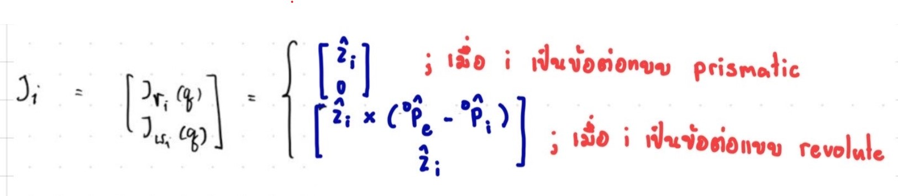
โดยที่เมื่อหุ่นยนต์ เป็น RRR-Robot ทำให้เลือกใช้สมการที่อ้างอิงกับ Revolute Joint คือ

- Jacobian เชิงเส้น
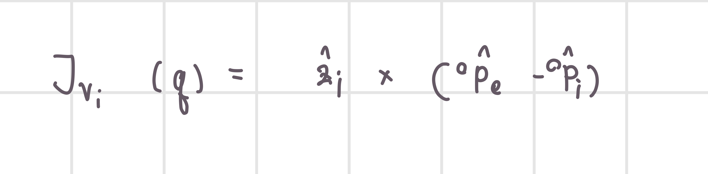
สามารถเขียนเป็น Code ได้ดังนี้ 
```
Jv_T[i] = np.cross(np.transpose(R[:,:,i] @ [[0],[0],[1]]), P0_e - P[:,i])[0]
```

- Jacobian เชิงมุม
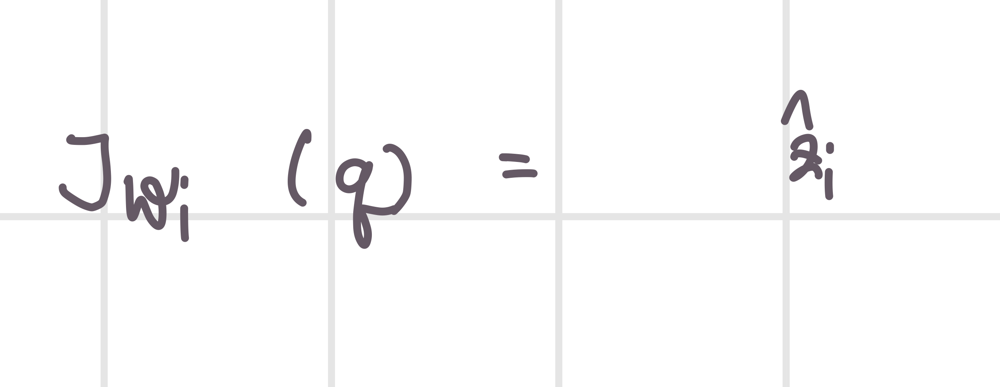
สามารถเขียนเป็น Code ได้ดังนี้
```
Jw_T[i] = np.transpose(R[:,:,i] @ [[0],[0],[1]])
```

และเพื่อให้ง่ายต่อการเก็บข้อมูล จึงแปลง zi จาก Matrix 3x1 เป็น Matrix 1x3 เพื่อให้ได้ผลลัพธ์ของการ cross เป็น Matrix 1x3 และเก็บ Jacobian เป็น Jacobian transpose


2. แปลงเป็น Jacobian จาก reference base เป็น reference end-effector
จาก Jacobian Transpose reference base นำไปคูณ Rotation Matrix จาก frame 0 ไป e (R0_e) เพื่อแปลงเป็น Jacobian Transpose reference end-effector
```
Jv_T = Jv_T @ R0_e
Jw_T = Jw_T @ R0_e
```
จากนั้นจึง Tranpose Jv_T และ Jw_T แล้ว Stack ค่าทั้ง 2 เข้าด้วยกันดังรูปสมการนี้
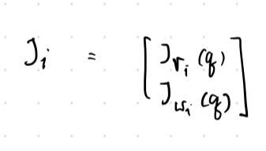
### คำตอบ Part 1 และวิธีการตรวจคำตอบ
เมื่อ Print ค่าที่ได้จาก def endEffectorJacobianHW3(q:list[float])->list[float] คำตอบที่ได้จะอยู่ในรูปของ Matrix 6x3 จากนั้นจึงนำคำตอบที่ได้ไปเปรียบเทียบกับคำตอบที่ได้จาก Libary Robotics toolbox จะได้ค่าดังนี้
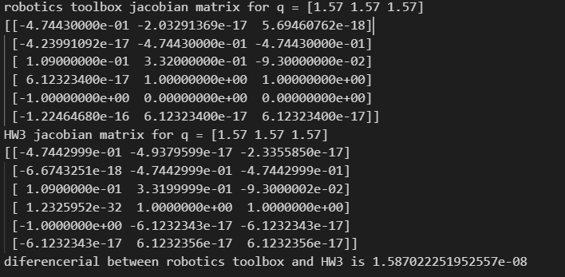

โดยที่เราได้นำค่าที่ได้ไปหาขนาดของผลต่างด้วย ฟังก์ชัน
```
np.linalg.norm()
```
จะเห็นได้ว่าผลต่างที่ได้มีค่า 1.587022251952557e-08 ซึ่งใกล้เคียงกับ 0

## Part 2
เพื่อ Check Singularity ของระบบอ้างอิงจากสมการ
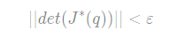
กล่าวคือ Singularity เกิดขึ้นเมื่อ Det ของ Matrix น้อยกว่าค่า Epsilon โดยที่กำหนดค่า Epsilon คือ 0.0001

ซึ่งเขียนเป็น Code ได้ดังนี้
```
def checkSingularityHW3(q:list[float])->bool:
    return abs(np.linalg.det(endEffectorJacobianHW3(q)[:3])) < 0.001
```
### คำตอบ Part 2 และวิธีการตรวจคำตอบ
ในส่วนของคำตอบจะอยู่ในรูปของ True False 
- เมื่อ Det ของ Matrix น้อยกว่าค่า Epsilon จะเป็น True 
- เมื่อ Det ของ Matrix มากกว่าค่า Epsilon จะเป็น False 

โดยที่เราได้เปรียบเทียบระหว่างค่าที่ได้จาก 
- Libary Robotics toolbox ที่ reference frame 0
- Libary Robotics toolbox ที่ reference frame e
- ค่าจาก ฟังก์ชัน checkSingularityHW3(q:list[float])

จะได้ดังนี้
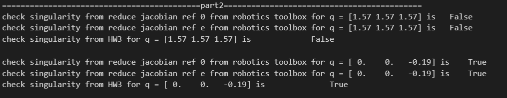
โดย Test Case จะถูกแบ่งออกเป็น 2 กรณี ซึ่งเมื่อเปรียบเทียบกันแล้วคำตอบที่ได้จะตรงกันทั้ง 2 กรณี

## Part 3
เพื่อหาค่า TAU ในแต่ละข้อต่อหุ่นยนต์ อ้างอิงจากสมการ
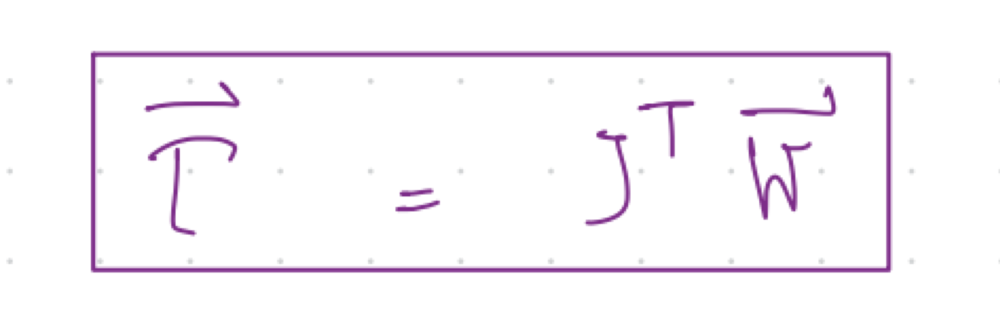
โดยที่ W คือ Matrix ของ force และ Moment ดังรูป
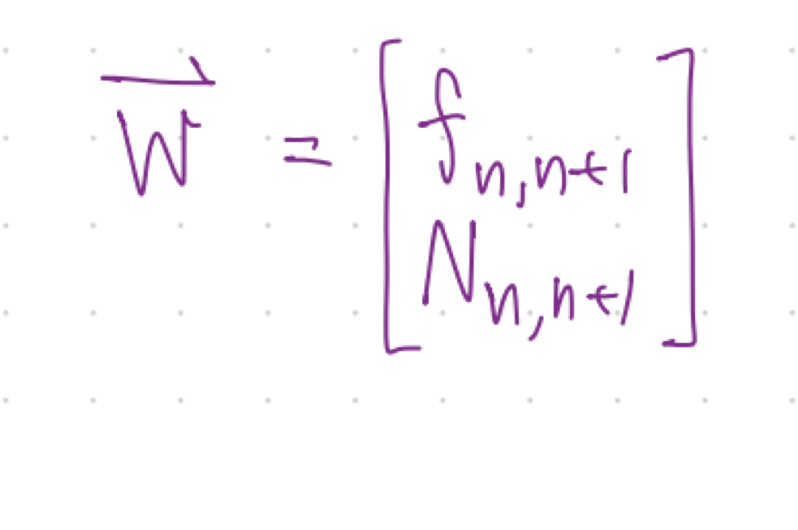
โดยที่จากโจทย์ W ที่ให้มาจะมีค่าดังนี้
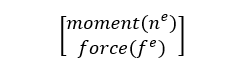
ดังนั้นจึงได้สลับตำแหน่งระหว่าง moment และ Force เพื่อให้สอคล้องกับ form ของ Matrix W เขียนเป็น Code ได้ดังนี้
```
w = [w[3], w[4], w[5], w[0], w[1], w[2]]
```
และสามารถเขียนออกมาได้ดังนี้
```
def computeEffortHW3(q:list[float], w:list[float])->list[float]:
    w = [w[3], w[4], w[5], w[0], w[1], w[2]]
    return endEffectorJacobianHW3(q).T @ w
```
### คำตอบ Part 3 และวิธีการตรวจคำตอบ
คำตอบจะเป็น Matrix nx1 ขึ้นอยู่กับจำนวน q ในหุ่นยนต์ โดยที่จากโจทย์ที่เป็น RRR-Robot คำตอบจึงมีขนาด 3x1 ตามจำนวน q

โดยที่เราจะเปรียบเทียบ ค่าที่ได้จากการหาขนาดของผลต่างด้วย ฟังก์ชัน
```
np.linalg.norm()
```
ดังรูปต่อไปนี้
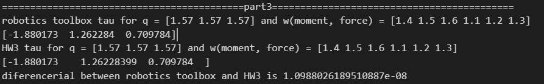
จะเห็นได้ว่าผลต่างของขนาดระหว่าง Libary Robotics toolbox และ จาก function computeEffortHW3(q:list[float], w:list[float]) มีค่าอยู่ที่ 1.0988026189510887e-08 มีค่าใกล้เคียง 0